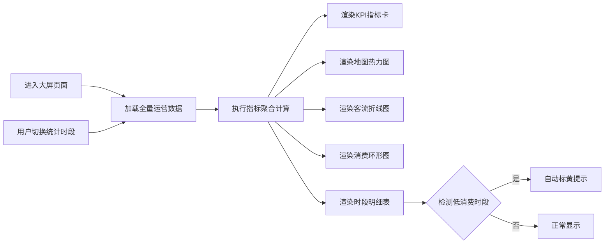

## 1. 产品概述

营地运营数据可视化大屏系统，面向营地运营管理人员，通过全量数据聚合和多维度指标计算，实时展示营地核心运营数据，辅助运营决策。

- 核心目标：将分散的营地运营数据进行聚合分析，以直观的可视化图表呈现客流、营位、消费等关键指标
- 目标用户：营地运营总监、现场管理人员、数据分析人员
- 产品价值：快速洞察营位热度、客流规律、消费结构，识别运营优化机会

## 2. 核心功能

### 2.1 用户角色

| 角色 | 注册方式 | 核心权限 |
|------|----------|----------|
| 运营管理员 | 系统内置 | 查看全部数据指标、切换统计时段 |

### 2.2 功能模块

1. **全屏可视化大屏**：统一展示所有统计内容，顶部KPI指标卡、中部图表区、底部数据明细
2. **地图热力图**：直观呈现营地各区域营位热门程度分布
3. **客流趋势折线图**：统计近一周每日客流起伏变化
4. **消费结构环形图**：展示帐篷租赁、烧烤食材、饮品等配套消费占比
5. **时段筛选器**：自由切换今日/本周/本月/本季度统计时段
6. **低消费时段预警**：自动标黄提示低消费时段，辅助运营调整

### 2.3 页面详情

| 页面名称 | 模块名称 | 功能描述 |
|----------|----------|----------|
| 数据大屏首页 | 顶部KPI指标区 | 展示总客流、总营收、平均客单价、入住率4项核心指标 |
| 数据大屏首页 | 地图热力图 | 营地平面示意图上以热力色阶展示各营位热度，鼠标悬停显示详情 |
| 数据大屏首页 | 客流趋势图 | 近7天/30天客流折线图，标注峰值与谷值 |
| 数据大屏首页 | 消费占比环形图 | 展示各消费品类营收占比与具体金额 |
| 数据大屏首页 | 时段筛选器 | 下拉切换今日/本周/本月/本季度统计范围 |
| 数据大屏首页 | 时段明细表 | 展示各时段客流与消费数据，低消费时段自动标黄 |

## 3. 核心流程

用户进入大屏页面 → 系统自动加载全量聚合数据 → 展示各类图表和指标 → 用户切换统计时段 → 数据实时刷新重新计算 → 低消费时段自动高亮标黄

## 4. 用户界面设计

### 4.1 设计风格

- **主色调**：深邃科技蓝 (#0A1628) 作为背景主色，营造专业数据大屏氛围
- **辅助色**：青绿色渐变 (#00D4FF → #00FF88) 用于数据高亮和图表主色
- **预警色**：暖黄色 (#FFB800) 用于低消费时段标黄提示
- **字体**：主标题使用 Orbitron 科技感字体，数据展示使用 JetBrains Mono 等宽字体，正文使用 Noto Sans SC
- **布局风格**：网格化对称布局，采用边框装饰面板，大屏沉浸式展示
- **图标风格**：线性简约图标，配合发光微动效

### 4.2 页面设计概述

| 页面名称 | 模块名称 | UI元素 |
|----------|----------|--------|
| 数据大屏首页 | 顶部标题栏 | 发光标题文字、实时时间显示、系统状态指示 |
| 数据大屏首页 | KPI指标卡 | 渐变边框、大数字展示、环比变化百分比、微动效 |
| 数据大屏首页 | 地图热力图 | 营地平面轮廓、营位网格、热力色阶图例、悬停详情浮层 |
| 数据大屏首页 | 客流折线图 | 渐变填充折线、数据点标注、峰值谷值高亮 |
| 数据大屏首页 | 消费环形图 | 多色环形分段、中心汇总数字、图例说明 |
| 数据大屏首页 | 时段筛选器 | 胶囊式切换按钮、选中态发光效果 |
| 数据大屏首页 | 时段明细表 | 表格布局、低消费行黄色背景高亮 |

### 4.3 响应式

采用固定全屏布局，桌面端优先，按 1920×1080 标准设计，支持 16:9 大屏自适应缩放。

### 4.4 动效设计

- 页面加载时各模块依次淡入入场（stagger 动画）
- 数据数字滚动动画效果
- 图表数据更新时平滑过渡动画
- 鼠标悬停时卡片轻微放大并增加发光效果
