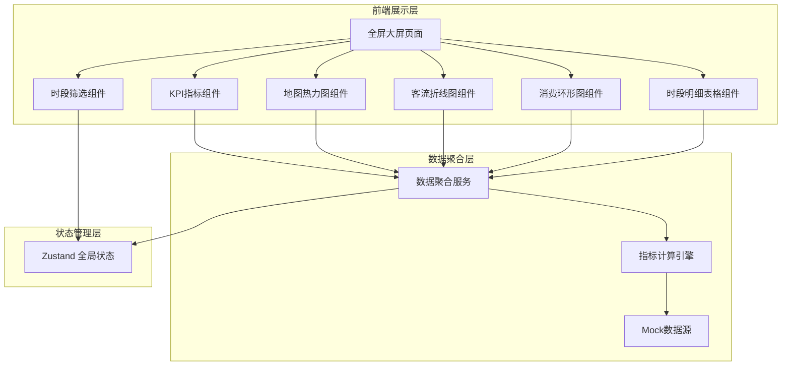

## 1. 架构设计



## 2. 技术描述

- **前端框架**：React@18 + TypeScript
- **构建工具**：Vite
- **样式方案**：TailwindCSS@3
- **图表库**：ECharts@5（支持热力图、折线图、饼图/环形图）
- **状态管理**：Zustand
- **图标库**：lucide-react
- **后端**：无后端，使用 Mock 数据模拟全量运营数据
- **数据源**：本地 TypeScript 模块生成结构化 Mock 数据

## 3. 路由定义

| 路由 | 用途 |
|------|------|
| / | 全屏数据可视化大屏首页 |

## 4. 数据模型

### 4.1 核心数据类型

```typescript
// 营位数据
interface Campsite {
  id: string;
  name: string;
  zone: string;
  x: number;
  y: number;
  popularity: number;
  capacity: number;
  currentOccupancy: number;
}

// 客流数据
interface VisitorData {
  date: string;
  hour: number;
  visitorCount: number;
  revenue: number;
}

// 每日客流汇总
interface DailyVisitor {
  date: string;
  weekday: string;
  totalVisitors: number;
  peakHour: number;
  valleyHour: number;
}

// 消费品类数据
interface ConsumptionCategory {
  id: string;
  name: string;
  revenue: number;
  orderCount: number;
  color: string;
}

// 时段数据
interface TimeSlotData {
  timeRange: string;
  startHour: number;
  endHour: number;
  visitorCount: number;
  revenue: number;
  avgSpend: number;
  isLowConsumption: boolean;
}

// KPI 指标
interface KPIData {
  totalVisitors: number;
  totalRevenue: number;
  avgSpendPerPerson: number;
  occupancyRate: number;
  visitorChange: number;
  revenueChange: number;
}

// 统计时段类型
type TimeRange = 'today' | 'week' | 'month' | 'quarter';

// 全局状态
interface DashboardState {
  selectedTimeRange: TimeRange;
  kpiData: KPIData;
  campsites: Campsite[];
  dailyVisitors: DailyVisitor[];
  consumptionCategories: ConsumptionCategory[];
  timeSlotData: TimeSlotData[];
  setTimeRange: (range: TimeRange) => void;
  refreshData: () => void;
}
```

### 4.2 指标计算逻辑

- **总客流**：统计时段内所有访客数求和
- **总营收**：统计时段内所有消费金额求和
- **平均客单价**：总营收 / 总客流
- **入住率**：当前占用营位数 / 总营位数 × 100%
- **营位热度值**：综合入住次数、停留时长、预订提前天数加权计算
- **低消费时段判定**：时段平均消费 < 整体平均消费 × 60% 标记为低消费

## 5. 项目目录结构

```
src/
├── components/
│   ├── dashboard/
│   │   ├── KPICard.tsx          # KPI指标卡组件
│   │   ├── HeatmapChart.tsx     # 地图热力图组件
│   │   ├── VisitorLineChart.tsx # 客流折线图组件
│   │   ├── ConsumptionRing.tsx  # 消费环形图组件
│   │   ├── TimeRangeFilter.tsx  # 时段筛选器组件
│   │   └── TimeSlotTable.tsx    # 时段明细表组件
│   └── ui/
│       ├── Panel.tsx            # 面板容器组件
│       └── StatNumber.tsx       # 滚动数字组件
├── data/
│   └── mockData.ts              # Mock数据生成
├── hooks/
│   └── useDashboardData.ts      # 数据聚合Hook
├── store/
│   └── dashboardStore.ts        # Zustand状态管理
├── types/
│   └── index.ts                 # 类型定义
├── utils/
│   └── calculator.ts            # 指标计算工具
├── pages/
│   └── Dashboard.tsx            # 大屏主页面
├── App.tsx
├── main.tsx
└── index.css
```
